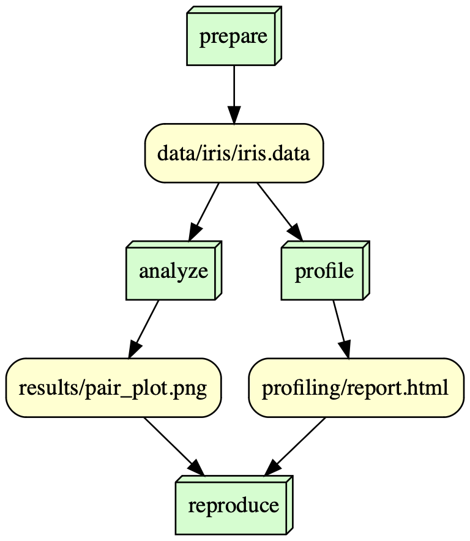

# UCI Iris Dataset

## Overview: 

This repository has the purpose of applyign the reproducibility concept when performing different analysis in the UCI Iris Dataset. Reproducibility is an important concept in which we use the same inputs and methods to try to get the same results. By applying it in this repository, we will be looking at the transparency of the study, the different license types and copyrights from the data and software, as well as how to properly cite the data and how to identify issues when trying to reproduce results. 

The Iris dataset is a classic dataset that contains samples from three species of Iris (Iris setosa, Iris virginica, and Iris versicolar). The dataset has five variables in total: sepal length, sepal width, petal length, petal width and class. Through this study, I looked into how this dataset provides insights to the differences between the three species and how we could differentiate between them by analyzing the different measures in each of those. This projects aims to produce a pair plot to be able to examine the differences in the species.

## Data Availability

**UCI Iris Dataset**

- The dataset was taken from the UC Irvine Machine Learning Repository (DOI: 10.24432/C56C76)

- The UCI Machine Learning Repository containing the dataset is under the following citation: 
Fisher,R. A.. (1988). Iris. UCI Machine Learning Repository. https://doi.org/10.24432/C56C76.

- License: This dataset is licensed under a Creative Commons Attribution 4.0 International (CC BY 4.0) license. It allows for the sharing and adaptation of the datasets for any purpose, provided that the appropriate credit is given.

- Therefore, under this license, we will be including the dataset in our repository, since, with the right credit given, it can be shared. The data is contained in the iris folder inside our data folder of this repository.

## Analysis

The Iris dataset allows us to identify different statistics about three species of Iris. This dataset includes the variables of sepal length, sepal width, petal length, and petal width. By analyzing the pair plot created, we are able to compare those measurements between species. The Iris Setosa can be idenfied by its shorter petal lengths and widths when compared to the Iris Versicolar and Iris Virginica. The two latter ones show similarities but can still be separated whem comparing those measures.

For all the Iris species, the summary statistics identified are as follows:

Sepal Length: Ranges from 4.3 to 7.9 cm, with an average of 5.84 cm.
Sepal Width: Ranges from 2.0 to 4.4 cm, with an average of 3.05 cm.
Petal Length: Ranges from 1.0 to 6.9 cm, with an average of 3.76 cm.
Petal Width: Ranges from 0.1 to 2.5 cm, with an average of 1.20 cm

The pair plot also allows to note that there is a positive correlation between petal length and petal width, as we see that as one measure increases, so does the other. On the other hand, sepal length and sepal width do not have a clear correlation pattern. The sepal width and sepal length also seem to overlap more between all three species, not being as good of a diferentiator factor as the petal measurements.

Through the report generated by our profiling we can also draw the same conclusions and visualize the graphs to see the correlation between each variable and identify the differences in species. We can also identify duplicates and missing values. For instance, there are two duplicate rows but no missing cells.

## Workflow

## Reproducing

To reproduce the contents in this project, you should follow the following steps:

1. Clone this repository.
2. Install Docker on your device.

3. To rerun all of the scripts use the following:

docker run -v ${PWD}:/is477 annem6/is477-fall2023-final-project:v1 snakemake --cores 1 reproduce

This utilizes both our docker image and our snakefile to run our workflow. 

4. To clean all outputs you can run: 

docker run -v ${PWD}:/is477 annem6/is477-fall2023-final-project:v1 snakemake --cores 1 reproduce --delete-all-output

## License

**Software Licensing**

The software license chosen was an MIT license. This license grants permission to any person obtaining a copy of this software and associated documentation files to deal with the software without restriction including without limitation the rights to use, copy, modify, merge, publish, distribute, sublicense, and/or sell
copies of the Software, and to permit persons to whom the Software is furnished to do so. The only requirement under this license is that individuals include the copyright notice and the permission notice in all copies or substantial portions of the Sofware. Those can be found under the LICENSE file on the repository.

The MIT License was chosen because it is one of the most permissive open-source licenses and allows users to work with the software with minimal restrictions. Therefore, it makes it easier to integrate and combine code from different sources. Furthermore, the MIT License can protect developers from legal liabilities since it does not provide warranties. 

**Data License**

The data license chosen is the Creative Commons Attribution 4.0 (CC-BY-4.0). It allows individuals to share - copy and redistribute the material in any medium or format, as well as adapt — remix, transform, and build upon the material for any purpose, including commercially, as long as appropriate credit is given, together with a link to the license, and indicate if changes were made.

This license was chosen because it promotes collaboration and sharing within the community by allowing others to use and share the data but also ensuring proper attribution of data.

## References

Fisher,R. A.. (1988). Iris. UCI Machine Learning Repository. https://doi.org/10.24432/C56C76.